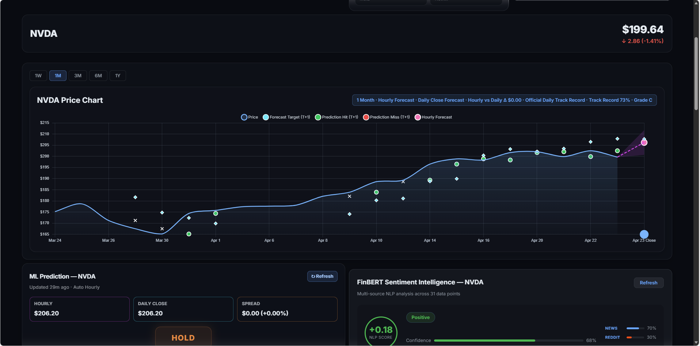
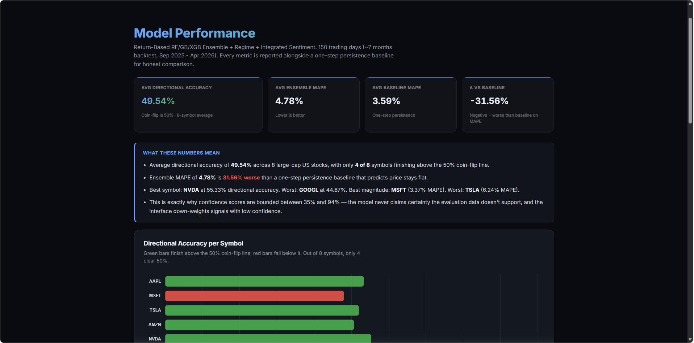
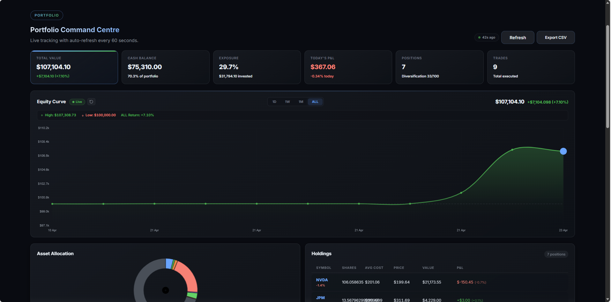
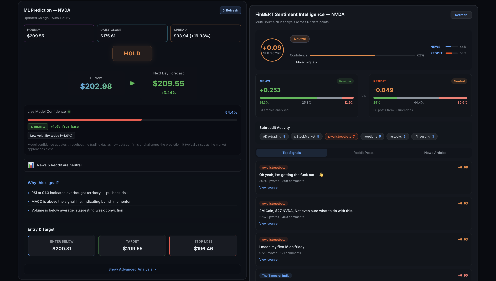
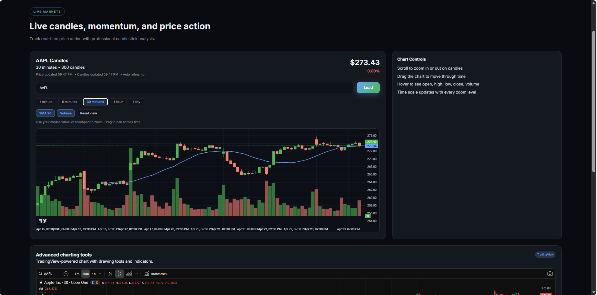
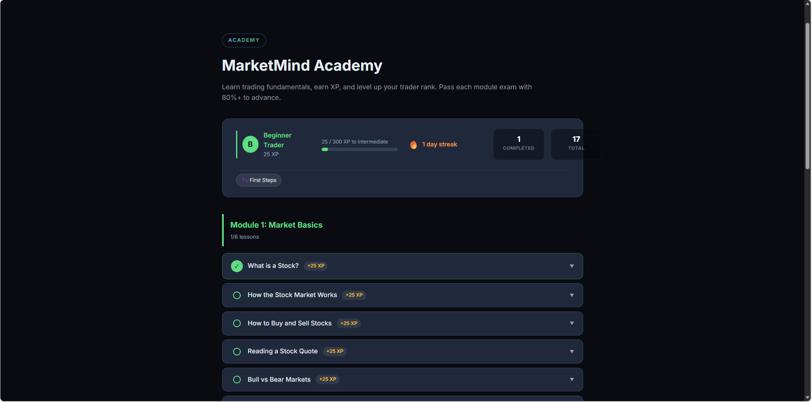

<div align="center">

  

  # MarketMind

  **Machine learning powered predictive trading platform with real-time AI stock predictions**

  [](https://github.com/MichaelFerry25/MachineLearningBasedPredictiveTradingPlatform/actions/workflows/ci.yml)
  [](https://react.dev/)
  [](https://spring.io/projects/spring-boot)
  [](https://python.org/)
  [](https://www.docker.com/)
  [](https://www.chartjs.org/)
  [](./LICENSE)

  **Live demo:** [marketmind.cfd](https://marketmind.cfd) · **Results dashboard:** [marketmind.cfd/#/results](https://marketmind.cfd/#/results) · **Screencast:** [YouTube (unlisted)](https://youtu.be/j162aCTeiIY)

  *Final Year Project · B.Sc. (Hons) Software Development · Atlantic Technological University (ATU), Galway · 2025–2026*
</div>

---

## Contents

- [Overview](#overview)
- [Key Results](#key-results)
- [Screenshots](#screenshots)
- [Problem Statement](#problem-statement)
- [Architecture](#architecture)
- [Features](#features)
- [Tracked Stocks](#tracked-stocks)
- [ML Model Details](#ml-model-details)
- [Sentiment Analysis](#sentiment-analysis)
- [Pages & Navigation](#pages--navigation)
- [Getting Started](#getting-started)
- [Docker Deployment](#docker-deployment)
- [API Endpoints](#api-endpoints)
- [Database Schema](#database-schema)
- [Project Structure](#project-structure)
- [Testing](#testing)
- [License](#license)
- [Author](#author)

---

## Overview

**MarketMind** is a full-stack predictive trading platform that gives retail investors access to institutional-grade market analysis tools. It combines real-time stock data, machine learning price predictions, FinBERT-powered financial sentiment analysis, paper trading, and a gamified learning module — all in a responsive web application.

- **ML-powered predictions** — ensemble of Random Forest, Gradient Boosting, and XGBoost models predicting 5-day forward returns using 29 technical indicators and macro signals
- **Continuous Learning & GridSearch** — Models auto-tune hyperparameters via GridSearchCV and continuously learn from new daily market data to adapt to regime changes
- **FinBERT sentiment analysis** — the production sentiment pipeline uses the ProsusAI/finbert transformer model exclusively, scoring financial news (NewsAPI) and Reddit discussions (6 subreddits) in batch. FinBERT is meaningfully better suited to financial text than general-purpose sentiment libraries, which misclassify domain phrases like "cutting costs", "diluted shares" or "headwinds"
- **Real-time market data** — live prices via Finnhub API, historical and candlestick charts via Yahoo Finance, market session tracking
- **Paper trading engine** — simulated trading with $100,000 virtual funds, portfolio tracking, equity curves, P&L analysis, and trade receipts
- **Research & analytics** — stock screener, research hub, analytics hub with model comparison, Fear & Greed gauge, and prediction track records
- **Results dashboard** — read-only Model Results page pinned to the canonical snapshot at [`ml-service/live_model_results.json`](./ml-service/live_model_results.json), showing aggregate hit rate, MAPE, per-symbol reliability grades, ensemble model comparison against naive baselines, and full track records
- **Gamified learning** — 16 lessons across 3 modules (Market Basics, Data Whiz, Market Pro) with XP, streaks, and badge achievements
- **Interactive dashboard** — React 19 UI with real-time updates, toast notifications, keyboard shortcuts, watchlists, and CSV export

---

## Key Results

Headline metrics below are drawn from the canonical snapshot at [`ml-service/live_model_results.json`](./ml-service/live_model_results.json), evaluated over a 150 trading-day backtest (Sep 2025 – Apr 2026) across all 8 tracked symbols. The same numbers are rendered live on the [Results page](https://marketmind.cfd/#/results).

| Metric | Value | Context |
|---|---|---|
| **Average direction accuracy** | **49.54%** | Across 8 symbols. NVDA best at 55.33%, GOOGL worst at 44.67%. 4 of 8 symbols clear 50%. |
| **Ensemble MAPE** | **4.78%** | Mean absolute percentage error on predicted 5-day forward price. |
| **Persistence-baseline MAPE** | **3.59%** | One-step persistence forecast (forward price = current price). |
| **Δ vs persistence** | **−31.6%** | The persistence baseline beats the ensemble on magnitude error. A deliberate trade-off, documented in the project limitations. |
| **Best symbol (direction)** | **NVDA, 55.33%** | Bullish-trend regime. |
| **Worst symbol (direction)** | **GOOGL, 44.67%** | Confidence pinned near 35% floor. |
| **Best symbol (MAPE)** | **MSFT, 3.37%** | Lowest magnitude error. |
| **Worst symbol (MAPE)** | **TSLA, 6.24%** | High-volatility regime. |
| **Backtest window** | **150 trading days** | Sep 2025 – Apr 2026 |
| **Predictions evaluated** | **1,200** | 150 days × 8 symbols |

**Evaluation methodology.** Two naive baselines are reported alongside every headline number, following the forecasting conventions in Hyndman & Athanasopoulos, *Forecasting: Principles and Practice* (3rd ed., 2021):

- **Directional baseline** — always predict the same direction (up *or* down), picking whichever scores higher on the symbol's window.
- **Persistence baseline** — predict that the forward closing price equals the current price (i.e. zero expected return).

A model that fails to beat both is indistinguishable from trivial rules. Reporting them alongside the ensemble's numbers prevents the common trap of claiming impressive accuracy that is actually just the prevailing market regime showing through. The snapshot is tamper-evident: every figure on the Results page can be verified directly against [`ml-service/live_model_results.json`](./ml-service/live_model_results.json) in this repository.

---

## Screenshots

> 🌐 **Live site:** [marketmind.cfd](https://marketmind.cfd) — all screenshots below captured from the production deployment.

### Dashboard & Predictions

*Main dashboard view — NVDA selected, 1-month price chart with forecast targets, hit/miss markers, daily-close and hourly forecasts overlaid, track-record grade, and the ML prediction and FinBERT sentiment cards below.*

### Model Performance — honest benchmarking against naive baselines

*Results page (`/results`) — headline KPIs rendered from the canonical snapshot: 49.54% directional accuracy, 4.78% ensemble MAPE, 3.59% persistence-baseline MAPE, and a −31.56% delta. Per-symbol directional-accuracy bar chart below shows only 4 of 8 symbols clear the 50% coin-flip line.*

### Portfolio & Paper Trading

*Portfolio Command Centre — live equity curve with +7.10% return, $107,104 total value across 7 positions and 9 executed trades, holdings table with per-position P&L, asset allocation donut, and CSV export.*

### Sentiment Analysis

*FinBERT Sentiment Intelligence panel — NLP score, news vs Reddit source agreement, subreddit activity breakdown across 6 finance communities, and scored top signals from individual posts. Paired with the ML prediction card showing Hold / Next-Day Forecast / Live Model Confidence and the "Why this signal?" feature-importance explanation.*

### Live Markets

*Live Markets page — AAPL 30-minute candles with SMA 20 overlay and volume bars via Lightweight Charts, with a full TradingView chart embedded below for professional-grade technical analysis.*

### Learning Module

*MarketMind Academy — 16 lessons across 3 modules (Market Basics, Data Whiz, Market Pro) with XP progression, streak tracking, and badges. Users pass each module exam with 80%+ to advance through Beginner → Intermediate → Advanced → Pro.*

---

## Problem Statement

Retail investors lack access to the sophisticated analysis tools available to institutional traders. Existing platforms like Bloomberg Terminal or Refinitiv charge thousands per year, while free alternatives lack predictive capabilities.

**MarketMind** offers a free, accessible platform that combines:

- Machine learning price predictions with calibrated confidence scoring
- Real-time market sentiment analysis using FinBERT NLP on financial news and Reddit
- Paper trading to practice strategies without financial risk
- A learning module to build foundational trading knowledge
- Clean, intuitive dashboard designed for quick decision-making

---

## Architecture

| Component | Tech Stack | Function |
|---|---|---|
| **Frontend** | React 19, Vite 7, Chart.js 4.5, Lightweight Charts | Dashboard, charts, trading UI, learning module, auth |
| **Backend API** | Spring Boot 3.2, Java 17, Spring Security, JPA/Hibernate | REST API, JWT auth, portfolio management, prediction logging |
| **ML Service** | Python 3.11, Flask, scikit-learn, XGBoost, PyTorch | Ensemble predictions, FinBERT sentiment, background scheduler |
| **Database** | PostgreSQL 15 with Hibernate ORM | Users, portfolios, trades, predictions, learning progress |
| **External APIs** | Finnhub, Yahoo Finance, NewsAPI, Reddit | Live prices, historical data, news and social sentiment |

```
┌──────────────────────┐
│   React Frontend     │ ← Nginx (Port 80)
│   Vite / Chart.js    │   SPA routing + API proxy
└──────────┬───────────┘
           │
      ┌────┴─────┐
      ↓          ↓
┌──────────┐ ┌──────────────┐
│  Spring  │ │  Python ML   │
│  Boot    │ │  Service     │
│  API     │ │  Flask       │
│  :8080   │ │  :5001       │
│          │ │              │
│  JWT Auth│ │  RF + GBR +  │
│  Postgres│ │  XGBoost     │
│  Trading │ │  FinBERT NLP │
└────┬─────┘ └──────┬───────┘
     │               │
     ↓               ↓
┌──────────────────────┐
│    External APIs     │
│  Finnhub · Yahoo     │
│  NewsAPI · Reddit    │
└──────────────────────┘
```

---

## Features

| Feature | Description |
|---|---|
| **Real-Time Stock Tracking** | Live price updates for 8 tracked equities via Finnhub API |
| **Ensemble ML Predictions** | Random Forest, Gradient Boosting, and XGBoost models with dynamic weighted averaging based on validation MAE |
| **FinBERT Sentiment Analysis** | Production sentiment pipeline using the ProsusAI/finbert transformer exclusively. Scores news (NewsAPI) and Reddit (6 subreddits) in batches of 16 with weighted source fusion |
| **Paper Trading** | Buy/sell simulation with $100k virtual portfolio, position averaging, and real-time P&L tracking |
| **JWT Authentication** | Secure user accounts with registration, login, profile management, password change, and user settings |
| **Equity Curve** | Interactive portfolio performance chart with gradient fill, crosshair tooltip, zoom/pan, and high/low watermarks |
| **Prediction History & Track Record** | Full history of past predictions with accuracy metrics, directional accuracy, evaluation against actuals |
| **Market Status Indicator** | Live display showing market open, pre-market, after-hours, or closed with countdown timer |
| **Trade Receipt Modal** | Detailed confirmation after each trade showing order ID, price, quantity, and realised P&L |
| **Confetti Animation** | Canvas-based particle celebration on profitable sell trades |
| **Stock Screener** | Filter and browse stocks with key metrics |
| **Research Hub** | Centralised research dashboard for in-depth stock analysis |
| **Analytics Hub** | Model comparison, global metrics, and prediction performance analytics |
| **News Sentiment Panel** | News articles and Reddit posts with per-article sentiment scores and source agreement signals |
| **Fear & Greed Gauge** | Market fear/greed index (0–100) derived from VIX and SPY signals |
| **Technical Indicators** | RSI, MACD, Stochastic, ADX, Bollinger Bands, moving averages displayed in interactive charts |
| **Feature Importance Chart** | Visual breakdown of which indicators drive predictions for each stock |
| **Model Performance Charts** | Predicted vs actual price comparison, accuracy over time, backtest visualisation |
| **Candlestick Charts** | Candlestick data with configurable intervals and output sizes |
| **Historical Charts** | Lightweight Charts JS rendering with 5D, 1M, 3M, 6M, 1Y ranges and track record overlay |
| **Custom Watchlist** | Personalised stock watchlist for quick access |
| **Learning Module** | 16 gamified lessons across 3 modules (Market Basics, Data Whiz, Market Pro) with XP, streaks, and badges |
| **Walk-Forward Backtester** | Expanding-window backtest, retrains every 30 trading days, reports Sharpe, alpha, drawdown, win rate |
| **Portfolio Optimiser** | Markowitz mean-variance optimisation via SciPy SLSQP — max Sharpe, min variance, efficient frontier |
| **Export to CSV** | Download portfolio holdings and trade history as CSV files |
| **Keyboard Shortcuts** | Keys 1–8 for quick stock selection, ? for help, and other navigation shortcuts |
| **Toast Notifications** | Real-time feedback on trade execution, errors, and system events |
| **Live Market View** | Dedicated real-time market data page |
| **User Settings** | Theme, notification preferences, and personalisation options |
| **Scheduled Predictions** | Background jobs running hourly predictions and daily close predictions (4 PM ET, Mon–Fri) with automatic evaluation |

---

## Tracked Stocks

The platform tracks and generates predictions for eight major US equities:

**AAPL** · **MSFT** · **TSLA** · **AMZN** · **NVDA** · **META** · **NFLX** · **GOOGL**

Predictions run on a configurable schedule (default: every 60 minutes) with a dedicated daily close prediction at 4 PM ET on weekdays. All predictions are automatically evaluated against actual prices.

---

## ML Model Details

The prediction engine uses a **return-based ensemble** approach rather than direct price prediction:

1. **Feature Engineering** — 29 features across 4 categories:
   - **Technical indicators (23):** SMA 20/50/200 with crossovers and distance-from-SMA-200, MACD and MACD histogram, RSI, momentum, rate of change, 1/5/10-day returns, Bollinger Band width and %, ATR ratio, volatility, volume ratio, OBV signal, ADX, Stochastic K, and 52-week high/low position
   - **FinBERT sentiment (2):** polarity score and confidence, computed by FinBERT over combined news and Reddit text
   - **Macro context (4):** VIX level, VIX 5-day change, SPY vs SMA 50, SPY 5-day return
   - All features normalised with scikit-learn `StandardScaler`, fit only on the training partition to prevent leakage

2. **Hyperparameter Optimized Models (GridSearchCV)** trained on 5 years of historical data:
   - Random Forest (300 estimators, max_depth=8)
   - Gradient Boosting (250 estimators, max_depth=4, learning_rate=0.02)
   - XGBoost (300 estimators, max_depth=5, learning_rate=0.02, L1/L2 regularisation)

3. **Continuous Online Learning** — Models automatically retrain and append new daily market data to their historical base, allowing them to adapt to live market regime shifts over time

4. **Dynamic Weighting & Sentiment Fusion** — Models weighted by inverse validation MAE. FinBERT sentiment scores integrated with a controlled max 2% return contribution.

5. **Confidence Calibration** — calibrated between 35–94% based on signal-to-noise ratio, model disagreement, and historical accuracy

6. **Output** — predicted price, % change, calibrated confidence, signal (STRONG_BUY / BUY / HOLD / SELL / STRONG_SELL), direction, market regime detection (bullish_trend, bearish_trend, high_volatility, range_bound), and prediction intervals

---

## Sentiment Analysis

Multi-source NLP sentiment powered by **FinBERT** (ProsusAI/finbert). **The production code path uses FinBERT exclusively**; TextBlob is retained only as a safety net for environments where the FinBERT weights cannot be loaded.

- **News** — last 7 days of articles from NewsAPI (up to 50 articles per symbol), batch-scored by FinBERT in batches of 16
- **Reddit** — last 7 days from 6 finance-focused subreddits: r/wallstreetbets, r/stocks, r/investing, r/StockMarket, r/options, r/Daytrading. Posts are weighted by engagement (upvotes + 2× comments) so high-signal threads influence the aggregate more than throwaway posts
- **Why FinBERT over general-purpose sentiment** — FinBERT is fine-tuned on financial text and correctly handles domain phrases like "cutting costs", "diluted shares", "beating expectations" and "headwinds" that TextBlob and similar libraries systematically misclassify
- **Scoring** — per-article/post polarity in [-1, +1], computed as P(positive) − P(negative); surfaced to the UI alongside positive/negative/neutral ratios
- **Source Agreement** — when news and Reddit agree on direction, combined confidence is boosted by 10 points; when they diverge, it is penalised by 10 points. Source weights are bounded 30–70% based on item counts
- **Caching** — 30-minute TTL to avoid redundant API calls and keep inference latency manageable

---

## Pages & Navigation

| Page | Route | Description |
|---|---|---|
| Overview | `/overview` | Landing page with hero section and platform introduction |
| Dashboard | `/dashboard` | Main trading interface with stock selection, charts, predictions, and trading panel |
| Analytics | `/analytics` | Analytics hub with model comparison and global metrics |
| Research | `/research` | Research dashboard for in-depth stock analysis |
| Results | `/results` | Model performance pinned to the committed snapshot: aggregate KPIs, per-symbol reliability grades, ensemble vs naive baselines, track record |
| Screener | `/screener` | Stock screening and filtering tool |
| Live Market | `/live` | Real-time market data view |
| Portfolio | `/portfolio` | Portfolio page with holdings, equity curve, trade history, and performance |
| Optimiser | `/optimizer` | Markowitz mean-variance portfolio optimiser (max Sharpe / min variance / efficient frontier) |
| Backtester | `/backtester` | Walk-forward ML strategy simulation with Sharpe, alpha, drawdown and equity curve |
| Learn | `/learn` | Gamified learning module with 16 lessons, XP, streaks, and badges |
| Profile | `/profile` | User profile management and portfolio summary |
| Settings | `/settings` | Theme, notifications, and personalisation preferences |
| Security | `/security` | Security information |
| About | `/about` | About MarketMind |

Plus legal routes (`/terms`, `/privacy`, `/disclaimer`, `/acceptable-use`, `/cookie-policy`) and an admin route (`/admin`) restricted to users with the `ADMIN` role.

---

## Getting Started

### Prerequisites

- Node.js 18+
- Java Development Kit 17
- Python 3.11+
- Finnhub API key ([free tier available](https://finnhub.io/))
- NewsAPI key ([free tier available](https://newsapi.org/))

---

## Quick Start

### 1. Clone and configure

```bash
git clone https://github.com/MichaelFerry25/MachineLearningBasedPredictiveTradingPlatform.git
cd MachineLearningBasedPredictiveTradingPlatform
cp .env.example .env
```

Edit `.env` with your keys:

```
FINNHUB_API_KEY=your_finnhub_key
NEWS_API_KEY=your_newsapi_key
JWT_SECRET=your_64_char_random_string
```

### 2. One-command dev run

```bash
./dev.sh        # Mac/Linux
dev.bat         # Windows
```

This starts all three services:
- **Frontend** → `http://localhost:5173` (Vite dev server with hot reload)
- **Backend** → `http://localhost:8080`
- **ML Service** → `http://localhost:5001`

> **Dev vs Docker ports.** Local development uses Vite's dev server on port **5173** for fast hot reload. The Docker deployment (below) uses Nginx on port **80** to serve the production React build. Both modes hit the same backend (`:8080`) and ML service (`:5001`).

---

## Docker Deployment

### Build and run with Docker Compose

```bash
docker-compose up --build
```

This starts four containers:
- **Frontend** (Nginx) → `http://localhost:80` — serves the production React build, proxies `/api/` to the backend and `/ml/` to the ML service
- **Backend** (Spring Boot) → `http://localhost:8080` — REST API with JWT auth, connected to the Postgres container over the internal Docker network
- **Postgres 15** (alpine) → `localhost:5432` — relational database; data persists via the named `db-data` volume
- **ML Service** (Flask) → `http://localhost:5001` — prediction engine with in-memory caching (30 min TTL) and background scheduler

All services have `restart: unless-stopped` and the Postgres volume survives `docker-compose down`.

---

## Manual Setup

### Backend

```bash
cd backend
./gradlew build
./gradlew bootRun
```

### ML Service

```bash
cd ml-service
python -m venv venv
source venv/bin/activate  # Windows: venv\Scripts\activate
pip install -r requirements.txt
python app.py
```

### Frontend

```bash
cd frontend
npm install
npm run dev
```

---

## API Endpoints

### Authentication
- `POST /api/auth/register` — Register new user
- `POST /api/auth/login` — Login and receive JWT token (60 min expiry)
- `GET /api/auth/me` — Get current user profile
- `PUT /api/auth/profile` — Update display name and email
- `PUT /api/auth/password` — Change password
- `GET /api/auth/settings` — Get user settings
- `PUT /api/auth/settings` — Update user settings

### Stock Data
- `GET /api/price/{symbol}` — Live stock price from Finnhub
- `GET /api/historical/{symbol}?range={range}` — Historical prices (1W, 1M, 3M, 6M, 1Y)
- `GET /api/candles/{symbol}?interval=&outputsize=` — Candlestick chart data
- `GET /api/news/{symbol}` — News articles with sentiment scores

### Machine Learning
- `GET /api/ml/predict/{symbol}?horizonHours=24` — Get cached or fresh prediction
- `POST /api/ml/predict/{symbol}/refresh?horizonHours=24` — Force refresh prediction
- `GET /api/ml/predict/{symbol}/detailed` — Detailed prediction with feature importance, model comparison, indicator timeseries, and backtest data
- `GET /api/ml/predict-comparison/{symbol}` — Compare predictions from different sources
- `GET /api/ml/scan` — Batch predict all 8 tracked symbols
- `GET /api/ml/sentiment/{symbol}` — Sentiment analysis breakdown (news + Reddit)
- `GET /api/ml/predictions/{symbol}?limit=50&source=` — Prediction history for a symbol
- `GET /api/ml/predictions?limit=25` — Recent predictions across all symbols
- `POST /api/ml/evaluate?horizonHours=24` — Evaluate pending predictions against actual prices
- `GET /api/ml/accuracy/{symbol}?days=30` — Accuracy metrics over time
- `GET /api/ml/track-record/{symbol}?days=180` — Full prediction track record with data points
- `GET /api/ml/metrics` — Global prediction metrics across all symbols
- `GET /api/ml/results-snapshot` — Canonical results snapshot (proxied to ML service)
- `GET /api/ml/health` — ML service health check

### ML Service (Flask — direct access on port 5001, 11 endpoints total)
- `GET /health` — Health check
- `GET /predict/<symbol>` — Get prediction with sentiment fusion
- `GET /predict/<symbol>/detailed` — Detailed prediction with 60-day indicator timeseries, feature importance and per-model breakdown
- `GET /predict/<symbol>/live-confidence` — Live intraday confidence updates as new data confirms or challenges the forecast
- `POST /batch-predict` — Batch predict multiple symbols
- `GET /sentiment/<symbol>` — Full FinBERT sentiment breakdown (news + Reddit + fusion)
- `POST /optimize-portfolio` — Markowitz mean-variance optimiser (max Sharpe / min variance / efficient frontier) via SciPy SLSQP
- `POST /backtest` — Expanding-window walk-forward backtest with retraining every 30 trading days; returns Sharpe, alpha, drawdown, win rate, profit factor, equity curve
- `GET /market-fear` — Fear & Greed index (0–100) derived from VIX and SPY
- `GET /scheduler/status` — Background scheduler status
- `POST /cache/clear` — Clear prediction and sentiment caches
- `GET /results/snapshot` — Canonical model results snapshot served to the Results page

### Trading (requires JWT auth)
- `POST /api/trading/buy` — Execute buy order
- `POST /api/trading/sell` — Execute sell order
- `GET /api/trading/portfolio` — Portfolio summary with holdings, equity curve snapshots, and cash balance
- `GET /api/trading/history` — Trade history with realised P&L
- `GET /api/trading/performance` — Performance metrics

### Learning (requires JWT auth)
- `GET /api/learning/progress` — Get learning progress, XP, streak, badges, completed lessons
- `POST /api/learning/complete` — Mark lesson as complete and award XP

---

## Database Schema

| Entity | Fields | Purpose |
|---|---|---|
| **UserAccount** | email, encrypted password, display name, role, created date | User authentication |
| **TradeEntity** | symbol, quantity, price, type (buy/sell), timestamp, realised P&L | Trade records |
| **HoldingEntity** | symbol, quantity, average cost price | Current positions |
| **UserCashBalance** | available cash (starts at $100,000) | Cash tracking |
| **PortfolioSnapshotEntity** | total value, cash, holdings value, timestamp | Equity curve data |
| **PredictionLog** | symbol, direction, signal, confidence, predicted price, actual price, accuracy, source, timestamp | Prediction tracking |
| **LearningProgress** | lesson ID, completed flag, XP earned | Lesson completion |
| **UserXP** | total XP, current streak, skill level, last activity date | Learning gamification |

---

## Project Structure

```
MarketMind/
├── backend/
│   └── src/main/java/ie/michaelferry/tradingapi/
│       ├── auth/              # JWT auth, Spring Security config, user entities
│       ├── controllers/       # StockController, MLController, TradingController, LearningController
│       ├── models/            # JPA entities (trades, holdings, predictions, learning)
│       ├── repositories/      # Spring Data JPA repositories
│       ├── services/          # TradingService, StockService, NewsService, PredictionLogService
│       └── ml/                # PredictionScheduler (hourly + daily close + evaluation)
├── frontend/
│   ├── public/
│   │   └── MarketMind.png     # Logo shown at the top of this README
│   └── src/
│       ├── components/
│       │   ├── auth/          # AuthPanel, ProfilePage
│       │   ├── layout/        # Navbar, Footer, HeroSection, Toast, MarketStatus, Confetti
│       │   ├── market/        # LiveMarket, StockScreener, StockInfo, Watchlist, PopularStocks
│       │   ├── charts/        # HistoricalChart, CandleChart, PerformanceChart
│       │   ├── trading/       # TradingPanel, Portfolio, EquityCurve, TradeHistory, TradeReceipt
│       │   ├── predictions/   # EnhancedPredictionCard, PredictionHistory, MLInsightsTabs
│       │   ├── research/      # ResearchHub, AnalyticsHub, NewsSentiment, ResultsHub, FearGreedGauge
│       │   └── pages/         # LearnPage, SettingsPage, AboutSection, SecuritySection
│       ├── App.jsx            # Router with 15+ pages
│       └── App.css            # Global styles
├── ml-service/
│   ├── app.py                 # Flask API with caching, scheduling, and Fear & Greed
│   ├── ml_model.py            # EnhancedStockPredictor (RF + GBR + XGB ensemble)
│   ├── sentiment_analyzer.py  # FinBERT (production) sentiment; TextBlob only as safety net
│   ├── backtester.py          # Walk-forward backtest engine
│   ├── portfolio_optimizer.py # Markowitz mean-variance optimiser
│   ├── live_model_results.json# Canonical results snapshot
│   └── requirements.txt       # Flask, scikit-learn, XGBoost, PyTorch, transformers, yfinance
├── docs/
│   └── screenshots/           # README assets — dashboard, results, portfolio, sentiment, livemarkets, learn
├── .github/workflows/ci.yml   # GitHub Actions CI — backend + ML tests on every push
├── docker-compose.yml         # 4-service deployment: frontend, backend, postgres, ml-service
├── dev.sh                     # One-command dev launcher (Mac/Linux)
├── dev.bat                    # One-command dev launcher (Windows)
└── README.md
```

---

## Testing

Automated tests run on every push to `main` via [GitHub Actions CI](./.github/workflows/ci.yml).

### Backend — JUnit 5

Unit and integration tests covering the security-critical and business-critical paths:

- `AuthServiceTest` — registration, login, duplicate email detection, BCrypt verification
- `JwtServiceTest` — token issuance, signature validation, expiry enforcement
- `RateLimitInterceptorTest` — per-IP rate limiting on the auth endpoints
- `TradingServiceTest` — buy/sell execution, cash balance checks, average-cost-basis maths, realised P&L

```bash
cd backend && ./gradlew test
```

### ML Service — Pytest

- `test_ml_model.py` — feature engineering, ensemble training, prediction pipeline, insufficient-data fallback
- `test_accuracy.py` — directional accuracy and MAPE assertions against the historical window

```bash
cd ml-service && python -m pytest
```

### Frontend — Vitest + React Testing Library

- `FearGreedGauge.test.jsx` — rendering and value-band logic

```bash
cd frontend && npm test
```

Frontend UI testing was otherwise carried out manually across Chrome, Firefox and Safari, and at desktop, tablet and mobile viewport widths.

---

## License

Released under the [MIT License](./LICENSE) — free to use, modify, and redistribute with attribution. The license also carries a standard "as-is / no warranty" clause, which is deliberate: MarketMind is a demonstration platform, not a financial-advice product.

---

## Author

**Michael Ferry** — B.Sc. (Hons) Software Development, Atlantic Technological University (ATU), Galway
Final Year Project · 2025–2026

- GitHub: [@MichaelFerry25](https://github.com/MichaelFerry25)
- Live deployment: [marketmind.cfd](https://marketmind.cfd)
- Screencast: [YouTube (unlisted)](https://youtu.be/j162aCTeiIY)

---

## Disclaimer

MarketMind is a demonstration platform developed for educational purposes as a final year project. It uses simulated trading with virtual funds. This software should not be used for actual trading decisions or financial advice. Past performance does not guarantee future results.
